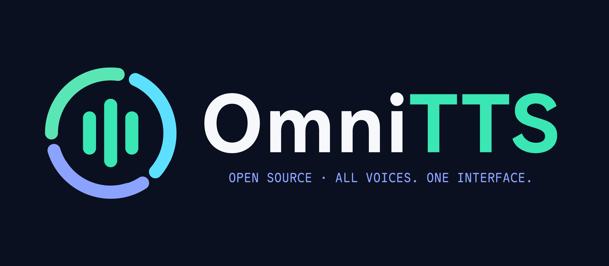

<div align="center">

#  OmniTTS <br>



[](https://github.com/HickoryTrail/OmniTTS/releases/latest)
[](https://github.com/HickoryTrail/OmniTTS/releases/latest)
[](https://github.com/HickoryTrail/OmniTTS/search?l=c%23)

</div>

OmniTTS 是面向 [ClassIsland 2.x](https://github.com/ClassIsland/ClassIsland) 的多提供方 TTS 插件：把多家云端语音服务统一成一个配置入口和一套 .NET API，让课堂播报、通知提醒、事件动作和自动化脚本都能用同样的方式生成并播放语音。

## ✨ 核心特性

- **六大 TTS 提供方，一个入口**：OpenAI、Gemini、FishAudio、ElevenLabs、MiniMax、MiMo（小米）统一管理，切换提供方只需改一个默认设置。
- **直接融入 ClassIsland**：插件注册为 ClassIsland 语音服务（`classisland.speech.omniTts`），ClassIsland 内置的语音播报入口可直接选择 OmniTTS 作为提供方；同时提供独立设置页，配置全程可视化。
- **播放与缓存分离**：既可以直接生成并播放，也可以只生成缓存文件；相同参数的请求会命中本地缓存并直接返回，不重复消耗 API 额度。
- **并发生成队列**：生成请求进入后台队列，最大并发数 1–20 可调（默认 5），配合批量缓存接口可高效预生成整批音频。
- **全程可取消**：生成、写盘、播放贯穿 `CancellationToken`；播放队列支持一键清空，已生成的缓存不受影响。
- **请求容错**：对网络异常、超时、429 限流和 5xx 错误自动重试（最多 3 次），尊重 `Retry-After` 响应头，否则按指数退避。
- **配置即改即存**：所有设置保存在插件配置目录的 `settings.json` 中，任意修改自动保存；API Key 仅存于本机配置文件。
- **兼容网关与自建代理**：每个提供方都可自定义 Base URL 并自动归一化，粘贴完整接口地址或服务根地址均可。
- **面向开发者的 SDK**：`OmniTTS.Shared` 以 NuGet 包形式提供 `IOmniTTS` 等公开类型，其他 ClassIsland 插件可直接引用调用。

## 🎙️ 支持的提供方

各提供方的预设默认值如下（实际使用时请以服务商控制台支持的模型、音色为准）：

| 提供方 | 默认 Base URL | 默认模型 | 默认音色 | 说明 |
| ------ | ------------- | ------- | ------- | ---- |
| OpenAI | `https://api.openai.com` | `gpt-4o-mini-tts` | `alloy` | 基于官方 OpenAI .NET SDK，输出 MP3 |
| Gemini | `https://generativelanguage.googleapis.com` | `gemini-3.1-flash-tts-preview` | `Kore` | 返回 PCM 音频，由插件封装为 WAV 文件 |
| FishAudio | `https://api.fish.audio` | `s2-pro` | `8ef4a238714b45718ce04243307c57a7` | 44.1 kHz / 128 kbps MP3 |
| ElevenLabs | `https://api.elevenlabs.io` | `eleven_multilingual_v2` | `JBFqnCBsd6RMkjVDRZzb` | MP3 44100 128 输出 |
| MiniMax | `https://api.minimax.io` | `speech-2.8-hd` | `English_expressive_narrator` | 32 kHz / 128 kbps MP3 |
| MiMo（小米） | `https://api.xiaomimimo.com` | `mimo-v2.5-tts` | `mimo_default` | chat-completions 风格的音频接口，暂不支持语速调节 |

## 🚀 快速开始

1. 从 [Releases](https://github.com/HickoryTrail/OmniTTS/releases) 下载最新的 `HickoryTrail.OmniTTS.cipx`（或通过配置的插件市场元数据在 ClassIsland 插件管理中安装），然后在 **插件管理** 中导入。
2. 打开 **设置 → OmniTTS 设置**，点击要使用的提供方，填写 **Base URL、API Key、模型、音色** 四项并开启“启用提供方”（四项缺一不可，未填全会自动禁用）。
3. 在“基本设置”中选择**默认 TTS 提供方**，并按账号限流情况调整“最大并发量”。
4. 触发语音：在 ClassIsland 中使用语音播报并选择 OmniTTS，或在自己的插件中调用 `IOmniTTS` 接口。

详细的安装、配置与排错说明见 [OmniTTS.Plugin/README.md](OmniTTS.Plugin/README.md)。

## 🧩 为开发者提供

其他 ClassIsland 插件可以通过引用 `OmniTTS.Shared`（[NuGet 打包](OmniTTS.Shared/README.md)，LGPL-3.0）获得完整的 TTS 能力——播放、生成缓存、批量生成、清空缓存，全部通过统一的 `IOmniTTS` 接口完成：

```csharp
using ClassIsland.Shared;
using OmniTTS.Shared;

// 在 ClassIsland 启动完成后获取服务
var tts = IAppHost.GetService<IOmniTTS>();

// 一行代码生成并播放语音（使用默认提供方配置）
await tts.PlayAudioAsync("欢迎使用 OmniTTS。", CancellationToken.None);

// 只生成缓存、不播放，返回音频文件路径
var path = await tts.GenerateCacheAsync("课前提示音", CancellationToken.None);
```

完整的接口签名、参数补全规则、批量与缓存语义见 [OmniTTS.Shared/README.md](OmniTTS.Shared/README.md)。

## 📁 项目结构

| 目录 | 说明 |
| --- | --- |
| `OmniTTS.Plugin` | ClassIsland 插件本体：设置页、提供方适配器、生成/播放队列 |
| `OmniTTS.Shared` | 公开 SDK：`IOmniTTS`、`TtsOption`、`Provider`，可打包为 NuGet |
| `docs` | 项目文档与各版本更新日志 |
| `scripts` | 本地一键发布打包脚本 |
| `.github` | GitHub Actions 构建/发布流水线与 Issue 模板 |
| `assests` | 项目 Logo 与 Banner 资源 |

## 🔧 构建与发布

- 任意 push / PR 都会触发 [构建流水线](.github/workflows/build.yml)，在 .NET 10 环境完成还原与 Release 构建。
- 推送 `x.x.x.x` 格式的 tag 会触发[发布流水线](.github/workflows/release.yml)：校验 tag 与主分支归属、生成 `HickoryTrail.OmniTTS.cipx` 插件包与 `OmniTTS.Shared` NuGet 包、计算 MD5 并生成发布说明，经环境审批后发布 GitHub Release，并将 NuGet 包发布到 NuGet.org 与 GitHub Packages。
- 也可以在本机用 `scripts/Package-Release.ps1` 一键产出同样的发布产物（cipx + nupkg + 发布说明）。
- 每个版本的更新日志与 **MD5 校验值** 见 [docs/CHANGELOG](docs/CHANGELOG)，下载后请核对文件 MD5。

## 💬 支持与反馈

欢迎通过 [Issues](https://github.com/HickoryTrail/OmniTTS/issues) 报告问题或提出新的 TTS 提供方需求。提交问题时请附上 ClassIsland 版本、OmniTTS 版本、所用提供方和相关日志；**不要粘贴 API Key**。

## 🎉 感谢

本项目使用了以下第三方项目和框架：

- [ClassIsland.PluginSdk](https://github.com/ClassIsland/ClassIsland/blob/master/ClassIsland.PluginSdk)
- [Svg.Controls.Skia.Avalonia](https://github.com/wieslawsoltes/Svg.Skia)
- [OpenAI](https://github.com/openai/openai-dotnet)
- [RestSharp](https://github.com/restsharp/restsharp)

## 📄 许可证

本项目中的以下项目基于 GNU Lesser General Public License v3.0 获得许可：

- [OmniTTS.Shared](https://github.com/HickoryTrail/OmniTTS/blob/master/OmniTTS.Shared)

本项目的其余部分（包括但不限于插件本体）基于 [GNU General Public License v3.0](https://github.com/ClassIsland/ClassIsland/blob/master/LICENSE.txt) 获得许可。
